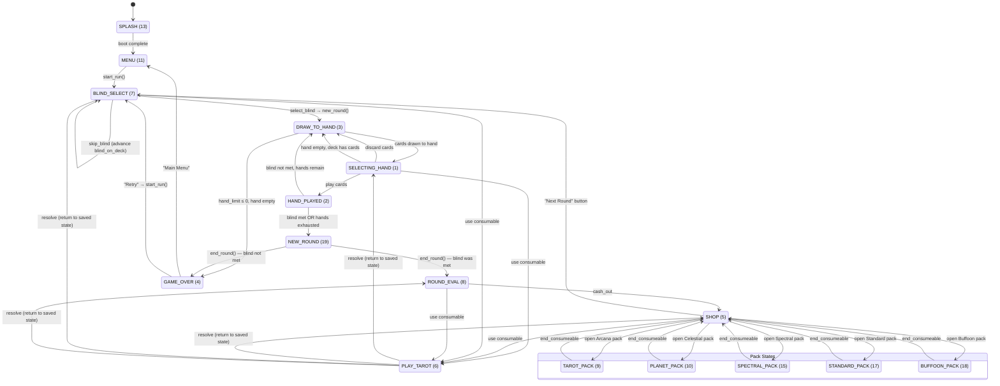

# Balatro State Machine

> **Reference documentation** — produced during initial Balatro v1.0.1o source analysis.
> The jackdaw engine is the authoritative implementation; see `jackdaw/engine/` for current behavior.

Complete map of every game phase, legal actions, transitions, and the interrupt
mechanisms for consumable use and booster pack opening.

---

## Control Variables

| Variable | Type | Description |
|----------|------|-------------|
| `G.STATE` | number | Current game state (see enum below) |
| `G.STATE_COMPLETE` | boolean | When set `false`, the state's init logic runs on the next frame; then set `true` |
| `G.STAGE` | number | High-level mode: `MAIN_MENU=1`, `RUN=2`, `SANDBOX=3` |
| `G.TAROT_INTERRUPT` | number/nil | Saves the interrupted `G.STATE` when a consumable is used |
| `G.GAME.PACK_INTERRUPT` | number/nil | Saves the pre-pack `G.STATE` when a booster is opened |

### State Enum (`G.STATES`, from `globals.lua`)

| Name | Value | Category |
|------|------:|----------|
| `SELECTING_HAND` | 1 | Core gameplay |
| `HAND_PLAYED` | 2 | Core gameplay |
| `DRAW_TO_HAND` | 3 | Core gameplay |
| `GAME_OVER` | 4 | Terminal |
| `SHOP` | 5 | Between rounds |
| `PLAY_TAROT` | 6 | Interrupt |
| `BLIND_SELECT` | 7 | Between rounds |
| `ROUND_EVAL` | 8 | Between rounds |
| `TAROT_PACK` | 9 | Pack (nested in SHOP) |
| `PLANET_PACK` | 10 | Pack (nested in SHOP) |
| `MENU` | 11 | Main menu |
| `TUTORIAL` | 12 | Tutorial |
| `SPLASH` | 13 | Boot |
| `SANDBOX` | 14 | Debug |
| `SPECTRAL_PACK` | 15 | Pack (nested in SHOP) |
| `DEMO_CTA` | 16 | Demo |
| `STANDARD_PACK` | 17 | Pack (nested in SHOP) |
| `BUFFOON_PACK` | 18 | Pack (nested in SHOP) |
| `NEW_ROUND` | 19 | Core gameplay |

---

## State Machine Diagram



---

## Detailed State Descriptions

### SPLASH (13)

| | |
|---|---|
| **Entry** | Game boot. Initial value of `G.STATE`. |
| **Actions** | None — displays logo, loads assets. |
| **Exit** | Boot completes → **MENU**. |

### MENU (11)

| | |
|---|---|
| **Entry** | `Game:prep_stage(STAGES.MAIN_MENU)` sets `G.STATE = STATES.MENU`. |
| **Actions** | Navigate menus, select profile, view collection, change settings. |
| **Update** | `update_menu` — empty function. All logic is in UI overlays. |
| **Exit** | Player starts a run → `G.FUNCS.start_run` → `Game:start_run()` → **BLIND_SELECT**. |

### BLIND_SELECT (7)

| | |
|---|---|
| **Entry** | (1) Run start: `start_run` sets initial state. (2) From SHOP: `toggle_shop` button. |
| **Actions** | Select a blind to play, skip a blind (gain tag), use consumables. |
| **Update** | `update_blind_select` — on `!STATE_COMPLETE`: saves run, creates blind select UI, applies tag effects (`new_blind_choice`, `shop_start` triggers), sets `STATE_COMPLETE=true`. |
| **Transitions** | |
| | **Select blind** → `G.FUNCS.select_blind` → `new_round()` → **DRAW_TO_HAND** |
| | **Skip blind** → `G.FUNCS.skip_blind` — stays in **BLIND_SELECT**, advances `blind_on_deck` (Small→Big→Boss), increments `G.GAME.skips`, applies skip tags |
| | **Use consumable** → **PLAY_TAROT** (via TAROT_INTERRUPT) |

### DRAW_TO_HAND (3)

| | |
|---|---|
| **Entry** | (1) From `new_round()` after blind is set. (2) From HAND_PLAYED when blind not yet met. (3) From SELECTING_HAND after discarding. (4) Inline in `update` when hand is empty but deck has cards. |
| **Actions** | None — automated card draw. |
| **Update** | `update_draw_to_hand` — on `!STATE_COMPLETE`: eases background colour, queues draw events (`draw_card` from deck to hand respecting hand limit), fires `drawn_to_hand` blind hook (Cerulean Bell forced selection, Crimson Heart joker debuff), fires `first_hand_drawn` joker calc on first draw. After draw completes → **SELECTING_HAND** (`STATE_COMPLETE=false`). |
| **Guard** | If `hand_limit ≤ 0` and hand is empty (and not in a pack state) → immediate **GAME_OVER** (`state_events.lua:358`). |
| **Source** | `game.lua` update_draw_to_hand, `state_events.lua` draw_from_deck_to_hand |

### SELECTING_HAND (1)

| | |
|---|---|
| **Entry** | From DRAW_TO_HAND after cards are drawn. |
| **Actions** | Highlight cards to play or discard, use consumables, view deck, sort hand. |
| **Update** | `update_selecting_hand` — on `!STATE_COMPLETE`: saves run, restores card focus, sets `STATE_COMPLETE=true`. Each frame: shows play/discard buttons, checks if hand+deck both empty → calls `end_round()`. |
| **Transitions** | |
| | **Play cards** → `play_cards_from_highlighted` (`state_events.lua:450`) — moves cards to play area, sets `G.STATE = HAND_PLAYED`, `STATE_COMPLETE=true` |
| | **Discard cards** → `discard_cards_from_highlighted` (`state_events.lua:379`) — discards highlighted, decrements discards_left, sets `G.STATE = DRAW_TO_HAND` |
| | **Hand empty, deck has cards** → inline check in `Game:update` → **DRAW_TO_HAND** |
| | **Hand+deck both empty** → `end_round()` → **GAME_OVER** or **ROUND_EVAL** |
| | **Use consumable** → **PLAY_TAROT** (via TAROT_INTERRUPT) |

### HAND_PLAYED (2)

| | |
|---|---|
| **Entry** | From SELECTING_HAND via `play_cards_from_highlighted`. `STATE_COMPLETE` is initially set to `true`. |
| **Actions** | None — automated scoring sequence. |
| **Update** | `update_hand_played` — removes buttons/shop UI. |
| **Scoring sequence** | `play_cards_from_highlighted` queues the full scoring pipeline as events: evaluate poker hand → get base chips/mult from `G.GAME.hands[handname]` → `blind:modify_hand` (The Flint halves) → per-card `eval_card` for played cards → per-joker `calculate_joker` → edition/seal bonuses → `Back:trigger_effect('final_scoring_step')` (Plasma Deck) → `ease_chips` with final score. |
| **STATE_COMPLETE=false trigger** | After all scoring events resolve and cards are drawn from play to discard, `STATE_COMPLETE` is set to `false` (`state_events.lua:531`). |
| **Transitions** | On `!STATE_COMPLETE` (in `update_hand_played`): |
| | **chips ≥ blind.chips** OR **hands_left < 1** → **NEW_ROUND** (`STATE_COMPLETE=false`) |
| | **Otherwise** → **DRAW_TO_HAND** (`STATE_COMPLETE=false`) |
| **Special** | Boss blind early beat: if `Blind:disable()` is called during play and chips already meet blind, it directly sets `G.STATE = NEW_ROUND` (`blind.lua:401`). |

### NEW_ROUND (19)

| | |
|---|---|
| **Entry** | From HAND_PLAYED when blind is met or hands are exhausted. Also from `Blind:disable()` early beat. |
| **Actions** | None — automated processing. |
| **Update** | `update_new_round` — on `!STATE_COMPLETE`: sets `STATE_COMPLETE=true`, calls `end_round()`. |
| **`end_round()` logic** (`state_events.lua:87`) | Evaluates joker end-of-round effects (Ramen, Mr. Bones, Luchador, etc.), checks if blind was beaten (chips ≥ blind.chips), processes card after-round effects (Glass Card break, perishable countdown), returns cards from hand/play to deck/discard, defeats blind. |
| **Transitions** | |
| | **Blind not met** → **GAME_OVER** (`STATE_COMPLETE=false`) |
| | **Blind met, not win ante** → **ROUND_EVAL** (`STATE_COMPLETE=false`) |
| | **Blind met, win ante boss** → **ROUND_EVAL** + `win_game()` queued |

### ROUND_EVAL (8)

| | |
|---|---|
| **Entry** | From `end_round()` when blind was beaten. |
| **Actions** | View round summary, use consumables. |
| **Update** | `update_round_eval` — on `!STATE_COMPLETE`: creates round eval UI, calls `evaluate_round()` which tallies: cards played/discarded/purchased, blind reward dollars, per-hand bonus, interest, per-discard bonus, joker dollar bonuses. Sets `STATE_COMPLETE=true`. |
| **Win handling** | If `win_game()` was queued, it fires during ROUND_EVAL: pauses game, shows win overlay with Jimbo. Game continues to "Endless Mode" if player unpauses. |
| **Transitions** | |
| | **Cash Out** → `G.FUNCS.cash_out` (`button_callbacks.lua:2912`) → **SHOP** (`STATE_COMPLETE=false`) |
| | **Use consumable** → **PLAY_TAROT** (via TAROT_INTERRUPT) |

### SHOP (5)

| | |
|---|---|
| **Entry** | From ROUND_EVAL via `cash_out`. |
| **Actions** | Buy jokers/consumables/vouchers, open booster packs, reroll shop, use consumables, sell jokers/consumables. |
| **Update** | `update_shop` — on `!STATE_COMPLETE`: creates shop UI (joker slots, voucher slots, booster slots), populates with cards from `get_current_pool`, applies voucher tag effects, sets `STATE_COMPLETE=true`. |
| **Transitions** | |
| | **"Next Round"** → `G.FUNCS.toggle_shop` (`button_callbacks.lua:2481`) → **BLIND_SELECT** (`STATE_COMPLETE=false`) |
| | **Open booster** → `Card:open()` (`card.lua:1681`) → **TAROT_PACK/PLANET_PACK/SPECTRAL_PACK/STANDARD_PACK/BUFFOON_PACK** (saves SHOP in `PACK_INTERRUPT`) |
| | **Use consumable** → **PLAY_TAROT** (via TAROT_INTERRUPT) |

### Pack States (9, 10, 15, 17, 18)

All five pack states follow the same pattern. They are **nested states** inside SHOP — the SHOP state is saved in `G.GAME.PACK_INTERRUPT` and restored when the pack closes.

| | |
|---|---|
| **Entry** | From SHOP via `Card:open()`. The specific state depends on pack type: Arcana→`TAROT_PACK`, Celestial→`PLANET_PACK`, Spectral→`SPECTRAL_PACK`, Standard→`STANDARD_PACK`, Buffoon→`BUFFOON_PACK`. |
| **Actions** | Select a card from the pack (use it or add to collection), skip remaining cards. |
| **Update** | Each has its own `update_*_pack` function. On `!STATE_COMPLETE`: creates pack UI, generates pack cards from pool, creates `G.pack_cards` CardArea, sets `STATE_COMPLETE=true`. |
| **Using a card inside a pack** | The consumable is used via `use_card`, but since `G.STATE` is already a pack state, it stays in the pack state (no PLAY_TAROT transition). `G.TAROT_INTERRUPT` is still set for rendering purposes. |
| **Transitions** | |
| | **Pick last card / Skip** → `G.FUNCS.end_consumeable` (`button_callbacks.lua:2565`) → restores `G.STATE = G.GAME.PACK_INTERRUPT` (typically **SHOP**) |

### PLAY_TAROT (6)

| | |
|---|---|
| **Entry** | From any non-pack state when a consumable is used: `G.FUNCS.use_card` (`button_callbacks.lua:2178`) saves `G.TAROT_INTERRUPT = G.STATE`, then sets `G.STATE = PLAY_TAROT`. |
| **Actions** | None — automated consumable resolution. |
| **Update** | `update_play_tarot` — minimal, just removes buttons. The consumable effect is driven entirely through `G.E_MANAGER` events queued by `Card:use_consumeable()`. |
| **Transitions** | After consumable resolves (card dissolves), the completion event restores `G.STATE = prev_state` and clears `G.TAROT_INTERRUPT` (`button_callbacks.lua:2263`). Returns to whichever state was interrupted: **SELECTING_HAND**, **SHOP**, **BLIND_SELECT**, or **ROUND_EVAL**. |

### GAME_OVER (4)

| | |
|---|---|
| **Entry** | (1) From `end_round()` when blind not met. (2) From `draw_from_deck_to_hand` when hand_limit ≤ 0. (3) Debug: `DT_lose_game`. |
| **Actions** | View game over screen, choose to retry or return to menu. |
| **Update** | `update_game_over` — on `!STATE_COMPLETE`: deletes save file, increments loss stats (`set_deck_loss`, `set_joker_loss`), resets win streak, plays game over sound, sets `G.PITCH_MOD=0.5`, pauses, shows overlay with Jimbo quip. Sets `STATE_COMPLETE=true`. |
| **Transitions** | |
| | **"Main Menu"** → `prep_stage(STAGES.MAIN_MENU)` → **MENU** |
| | **"New Run" / "Retry"** → `start_run()` → **BLIND_SELECT** |

---

## Interrupt Mechanisms

### TAROT_INTERRUPT (consumable use)

Consumables can be used during SELECTING_HAND, SHOP, BLIND_SELECT, or ROUND_EVAL.
The mechanism:

1. **Save**: `G.TAROT_INTERRUPT = G.STATE` (stores current state)
2. **Transition**: `G.STATE = G.STATES.PLAY_TAROT`
3. **UI**: Shop/blind-select/round-eval panels slide off-screen
4. **Execute**: Consumable effect runs via event queue (`Card:use_consumeable()`)
5. **Restore**: `G.STATE = prev_state`, `G.TAROT_INTERRUPT = nil`
6. **UI**: Panels slide back on-screen

**Inside pack states**: If a consumable is used while already in a pack state (e.g.,
using a Tarot card received from an Arcana pack), `G.STATE` stays as the pack state.
`G.TAROT_INTERRUPT` is still set (for rendering hints in `cardarea.lua:274`) but the
state doesn't change to PLAY_TAROT.

### PACK_INTERRUPT (booster pack opening)

Booster packs can only be opened from SHOP.

1. **Save**: `G.GAME.PACK_INTERRUPT = G.STATE` (stores SHOP)
2. **Transition**: `Card:open()` sets `G.STATE` to the appropriate pack state
3. **Browse**: Player picks cards from pack or skips
4. **Restore**: `G.FUNCS.end_consumeable` sets `G.STATE = G.GAME.PACK_INTERRUPT`, clears it

Pack states are effectively **sub-states of SHOP** — the shop UI is still present
(slid off-screen) and is restored when the pack closes.

---

## Normal Gameplay Flow

A complete ante cycle:

```
BLIND_SELECT                    Player picks Small/Big/Boss blind
    │
    ▼
DRAW_TO_HAND ──────────────────► SELECTING_HAND
    ▲                               │         │
    │                               │         │
    │  ┌────── discard ─────────────┘         │
    │  │                                      │
    │  └──► DRAW_TO_HAND                      │
    │           │                             │
    │           └──► SELECTING_HAND           │
    │                                         │
    │              play hand ─────────────────┘
    │                    │
    │                    ▼
    │              HAND_PLAYED
    │                    │
    │         ┌──────────┼──────────┐
    │     blind not   blind met   hands
    │     met, hands  or beat     exhausted,
    │     remain                  blind not met
    │         │          │              │
    │         ▼          ▼              ▼
    └── DRAW_TO_HAND  NEW_ROUND     NEW_ROUND
                         │              │
                    end_round()    end_round()
                         │              │
                    ROUND_EVAL     GAME_OVER
                         │
                      cash_out
                         │
                       SHOP ◄──── end_consumeable ◄── PACK STATES
                         │
                    "Next Round"
                         │
                    BLIND_SELECT  (next ante if boss was beaten)
```

---

## State Accessibility Matrix

Which actions are available in which states:

| Action | SELECTING_HAND | SHOP | BLIND_SELECT | ROUND_EVAL | Pack States |
|--------|:-:|:-:|:-:|:-:|:-:|
| Play hand | ✓ | | | | |
| Discard | ✓ | | | | |
| Use consumable | ✓ | ✓ | ✓ | ✓ | ✓* |
| Buy card | | ✓ | | | |
| Sell card | | ✓ | | | |
| Reroll shop | | ✓ | | | |
| Redeem voucher | | ✓ | | | |
| Open booster | | ✓ | | | |
| Pick pack card | | | | | ✓ |
| Skip pack | | | | | ✓ |
| Select blind | | | ✓ | | |
| Skip blind | | | ✓ | | |
| Cash out | | | | ✓ | |
| Sort hand | ✓ | | | | |
| View deck | ✓ | ✓ | ✓ | ✓ | |

\* Inside pack states, using a consumable doesn't change `G.STATE` to PLAY_TAROT — the effect runs within the pack state itself.

---

## Source File Reference

| File | Key state logic |
|------|-----------------|
| `game.lua:~2544` | Main `update()` dispatch — checks `G.STATE`, calls `update_*` |
| `game.lua:3010` | `update_selecting_hand` |
| `game.lua:3072` | `update_shop` |
| `game.lua:3183` | `update_play_tarot` |
| `game.lua:3187` | `update_hand_played` |
| `game.lua:3208` | `update_draw_to_hand` |
| `game.lua:3248` | `update_new_round` |
| `game.lua:3258` | `update_blind_select` |
| `game.lua:3302` | `update_round_eval` |
| `game.lua:3341` | `update_arcana_pack` |
| `game.lua:3392` | `update_spectral_pack` |
| `game.lua:3443` | `update_standard_pack` |
| `game.lua:3492` | `update_buffoon_pack` |
| `game.lua:3528` | `update_celestial_pack` |
| `game.lua:3581` | `update_game_over` |
| `state_events.lua:87` | `end_round()` — GAME_OVER vs ROUND_EVAL branch |
| `state_events.lua:290` | `new_round()` — sets DRAW_TO_HAND |
| `state_events.lua:379` | `discard_cards_from_highlighted` — SELECTING_HAND→DRAW_TO_HAND |
| `state_events.lua:450` | `play_cards_from_highlighted` — SELECTING_HAND→HAND_PLAYED |
| `button_callbacks.lua:2178` | `use_card` — TAROT_INTERRUPT mechanism |
| `button_callbacks.lua:2481` | `toggle_shop` — SHOP→BLIND_SELECT |
| `button_callbacks.lua:2513` | `select_blind` — BLIND_SELECT→new_round() |
| `button_callbacks.lua:2565` | `end_consumeable` — pack→PACK_INTERRUPT |
| `button_callbacks.lua:2912` | `cash_out` — ROUND_EVAL→SHOP |
| `card.lua:1681` | `Card:open()` — SHOP→pack states |
| `blind.lua:401` | `Blind:disable()` — early beat→NEW_ROUND |
